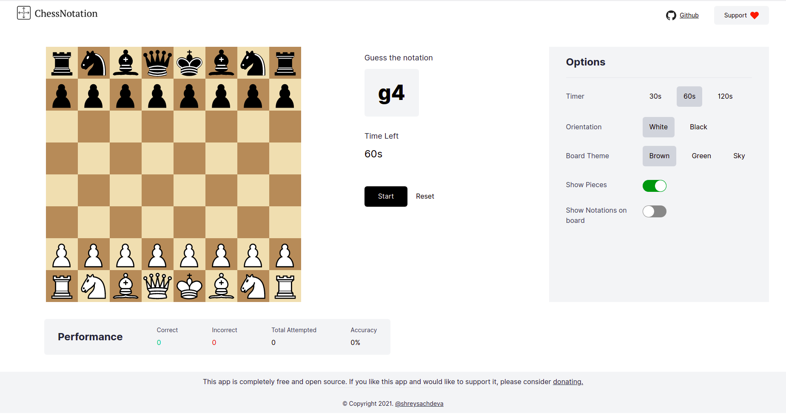

<div align="center">
  
</div>

<br>
<p align="center">
  Learn Chess Notations to analyse, visualise and review games.
</p>
<p align="center">
crafted with <span style="color: #8b0000;">&hearts;</span> by Shrey Sachdeva.
</p>
<p align="center">
    
    
    
</p>

## Preview 📺

<div align="center">
  
</div>

## Development 🔧

**Install dependencies**

```
$ yarn
```

**Create a production build**

```
$ yarn build
```

## License 📜

`ChessNotation` is available under the MIT license. See the `LICENSE` file for more info.

## Contributing 🤝

Please read `Contributing.md` for details on our code of conduct, and the process for submitting pull requests to us.

## Shout outs 💥

This project wouldn't have been possible without this amazing project — [chessboardjsx](https://github.com/willb335/chessboardjsx) 

## Forking this repo 🚨

Many people have contacted me asking if they can use this code for their own websites. The answer to that question is usually "yes", with attribution. There are some cases, such as using this code for a business or something that is greater than a personal project, that I may be less comfortable saying yes to. If in doubt, please don't hesitate to ask me.

I value keeping this site open source, but as you all know, _**plagiarism is bad**_. I spent a non-negligible amount of effort developing, designing to build this project! All I ask is to not claim this effort as your own.

So, feel free to fork this repo. If you do, please just give us proper credit by linking back to this website, https://chessnotation.xyz. Refer to this handy [quora post](https://www.quora.com/Is-it-bad-to-copy-other-peoples-code) if you're not sure what to do. Thanks!
